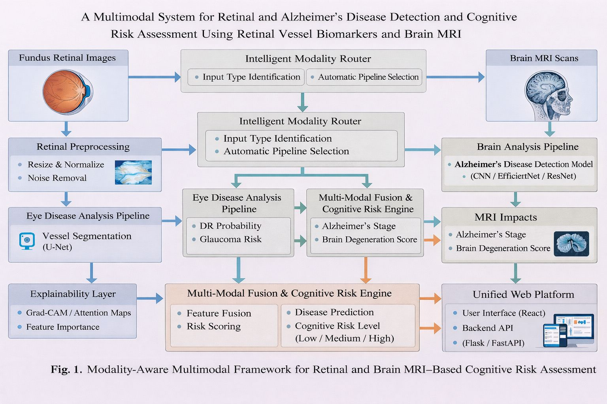
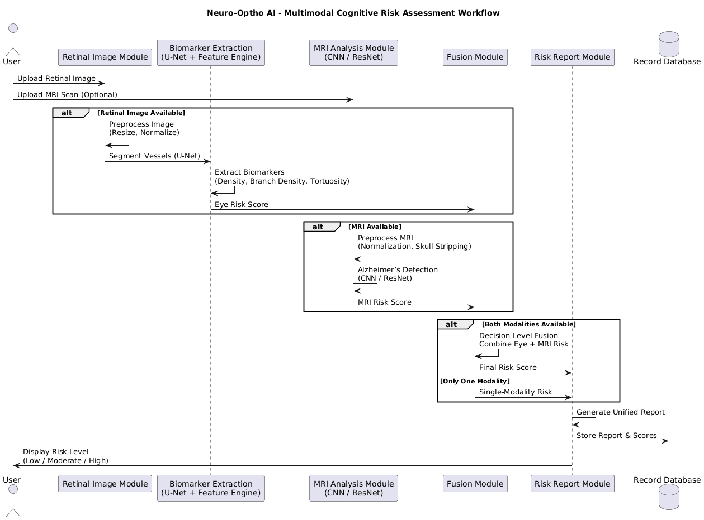

# 🧠 Neuro-Optho AI

### 👁️ Retinal Disease Detection | 🧠 Alzheimer's Classification | 🔬 Cognitive Risk Assessment

---

## 🏷️ Badges

<p align="center">


</p>

---

# 📌 Overview

Neuro-Optho AI is a multimodal deep learning framework developed for early cognitive risk assessment and neurodegenerative disease screening using retinal fundus images and brain MRI scans.

The system combines retinal disease detection, retinal vessel segmentation, retinal biomarker analytics, Alzheimer's disease classification, multimodal risk fusion, and explainable AI to generate a comprehensive cognitive risk score.

---

# 🎯 Key Features

- 👁️ Glaucoma Detection using EfficientNet
- 👁️ Diabetic Retinopathy Detection
- 🌐 Retinal Vessel Segmentation using U-Net
- 📊 Vessel Biomarker Extraction
- 🧠 Alzheimer's Disease Classification using DenseNet
- 🎯 Eye Cognitive Risk Score Generation
- 🎯 Brain Risk Score Generation
- 📈 Multimodal Risk Fusion
- 🔍 Explainable AI using Grad-CAM
- 📄 Automated Medical Report Generation
- ☁️ Cloud Deployment Ready

---

# 🧠 AI Models Used

| Model | Purpose |
|---------|---------|
| EfficientNet-B0 | Glaucoma Detection |
| EfficientNet | Diabetic Retinopathy Detection |
| U-Net (ResNet34 Encoder) | Retinal Vessel Segmentation |
| DenseNet | Alzheimer's Disease Classification |
| Grad-CAM | Explainable AI Visualization |

---

# 🏗️ System Architecture

<p align="center">
  
</p>

<p align="center">
<b>Figure 1:</b> Multimodal Neuro-Optho AI Architecture
</p>

---

# ⚙️ System Workflow

<p align="center">
  
</p>

<p align="center">
<b>Figure 2:</b> Workflow of the Neuro-Optho AI System
</p>

---

# 🚦 Output Parameters

| Output | Description |
|----------|----------|
| Glaucoma Probability | Risk of Glaucoma |
| DR Probability | Risk of Diabetic Retinopathy |
| Vessel Density | Retinal Vascular Density |
| Branch Density | Retinal Branching Pattern |
| Tortuosity | Vessel Curvature Measure |
| Eye Risk Score | Ocular Cognitive Risk |
| Alzheimer Stage | MRI Classification Output |
| Brain Risk Score | Neurological Risk |
| Final Cognitive Risk Score | Combined Risk Assessment |
| Risk Level | Low / Moderate / High |

---

# 👁️ Retinal Biomarker Analysis

<p align="center">
  
</p>

<p align="center">
<b>Figure 3:</b> Retinal Vessel Biomarker Extraction
</p>

The U-Net segmentation model extracts retinal vascular structures and computes:

- Vessel Density
- Branch Density
- Tortuosity Index

These biomarkers are used to generate the Eye Cognitive Risk Score.

---

# 🧠 MRI-Based Alzheimer's Classification

<p align="center">
  
</p>

<p align="center">
<b>Figure 4:</b> Alzheimer's Stage Classification using DenseNet
</p>

The DenseNet model classifies MRI scans into:

- Non Demented
- Very Mild Demented
- Mild Demented
- Moderate Demented

and generates the Brain Risk Score.

---

# 🛠️ Technology Stack

## Backend


## Deep Learning & AI


## AI Models


---

# 🤗 Model Hosting

Due to GitHub file size limitations, trained model weights are hosted on Hugging Face.

Repository:

https://huggingface.co/Avi-Valavoju/neuro-optho-models

The backend automatically downloads:

- 03_eye_glaucoma_classifier_efficientnet.pth
- 03_eye_vessel_unet.pth
- dr_final_messidor.keras
- alz_densenet_best.keras

No manual download is required.
# 🔍 Explainable AI (Grad-CAM)

<p align="center">
  
</p>

<p align="center">
<b>Figure 5:</b> Grad-CAM Visualization
</p>

Grad-CAM highlights the image regions contributing most strongly to model predictions, improving transparency and clinical interpretability.

---

# 📡 API Endpoints

## Health Check

```http
GET /
```

Response

```json
{
  "message": "Neuro-Optho AI Running"
}
```

---

## Prediction Endpoint

```http
POST /predict
```

### Form Data

| Parameter | Type |
|------------|--------|
| fundus | Image |
| brain | Image |

### Response

```json
{
  "glaucoma_prob": 0.91,
  "dr_prob": 0.84,
  "alz_stage": "Very Mild Demented",
  "eye_score": 20,
  "brain_score": 30,
  "final_score": 25,
  "risk_level": "Low"
}
```

---

# ▶️ Installation

## Clone Repository

```bash
git clone https://github.com/your-username/Neuro-Optho-AI.git

cd Neuro-Optho-AI
```

## Install Dependencies

```bash
pip install -r requirements.txt
```

## Run Application

```bash
python app.py
```

Backend starts on:

```text
http://127.0.0.1:10000
```

---

# 📁 Repository Structure

```text
Neuro-Optho-AI/
│
├── WorkFlow.png
├── architecture.png
├── brain.png
├── eye.png
├── gradcam.png
│
├── models/
│   └── README.md
│
├── app.py
├── requirements.txt
├── runtime.txt
├── .gitignore
└── README.md
```

---

# 🚀 Deployment

Supported Platforms:

- Render
- Railway
- Hugging Face Spaces
- Docker
- VPS Servers

Model weights are downloaded automatically from Hugging Face during startup.

---

# 🎯 Applications

- Neurodegenerative Disease Screening
- Alzheimer's Disease Risk Assessment
- Ophthalmic Disease Diagnosis
- Telemedicine Systems
- Clinical Decision Support Systems
- AI-Based Healthcare Research

---

# 👨‍💻 Authors

## Faculty Mentor

- Mrs. G. Aishwarya

## Student Team

- Avinash Valavoju
- N. Joy Darren
- E. Ramya
- N. Sarayu

---

# 📄 License

This project is developed for academic research, healthcare innovation, and educational purposes.

---

# 🌟 Show Your Support

If you find this project useful:

⭐ Star this repository

🍴 Fork this repository

📢 Share it with others

---

# 🚀 Vision

> "The eye is the window to the brain. Neuro-Optho AI transforms retinal and neuroimaging data into actionable cognitive insights through multimodal artificial intelligence."
